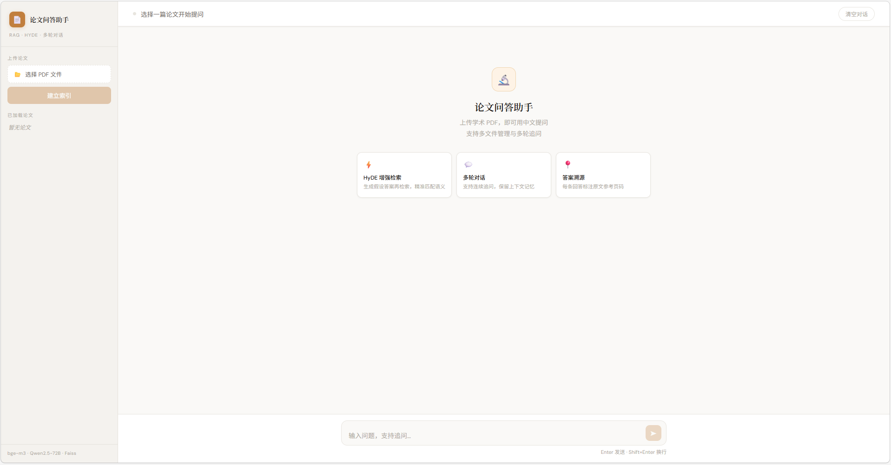

# 📄 论文问答助手

基于 RAG 架构的学术论文问答系统，支持上传 PDF 论文并用中文进行多轮问答。



## ✨ 功能特性

- **HyDE 增强检索** — 先生成假设答案再检索，精准匹配中文问题与英文论文语义
- **多轮对话** — 保留对话历史，支持连续追问
- **答案溯源** — 每条回答附带原文参考页码
- **多文件管理** — 支持上传多篇论文并自由切换
- **访问密码保护** — 防止 Token 被滥用

## 🏗️ 技术架构
```
用户提问（中文）
    ↓
HyDE：大模型生成假设答案（英文）
    ↓
bge-m3 向量化 → Faiss 检索 → 重排序过滤
    ↓
检索到最相关文本块（Top 7）
    ↓
Qwen2.5-72B 结合对话历史生成回答
    ↓
返回答案 + 参考页码
```

## 🛠️ 技术栈

| 模块 | 技术 |
|------|------|
| PDF 解析 | PyMuPDF |
| 文本切分 | LangChain RecursiveCharacterTextSplitter |
| 向量模型 | BAAI/bge-m3（多语言） |
| 向量索引 | Faiss IndexFlatL2 |
| 生成模型 | Qwen2.5-72B-Instruct（硅基流动 API） |
| 后端框架 | Flask |
| 部署 | Cloudflare Tunnel |

## 🚀 快速开始

**1. 安装依赖**
```bash
pip install -r requirements.txt
```

**2. 配置环境变量**

新建 `.env` 文件：
```
SILICONFLOW_API_KEY=你的API Key
ACCESS_PASSWORD=你设置的访问密码
```

**3. 启动服务**
```bash
python app.py
```

**4. 公网访问（可选）**
```
cloudflared tunnel --url http://localhost:5000
```
生成的链接即为公网访问地址，国内无需翻墙，Ctrl+C 关闭后链接立刻失效。

## 📁 项目结构
```
RAG/
├── app.py          
├── requirements.txt 
├── .env            
└── .gitignore        
```

## 💡 核心技术亮点

**HyDE（Hypothetical Document Embeddings）**

普通 RAG 直接用问题向量检索，中文问题和英文论文存在语义空间偏差。
HyDE 先让大模型生成一段假设答案（英文学术风格），再用假设答案检索，
两者语义空间高度重合，检索精度显著提升。

**检索后重排序**

从 Faiss 检索 15 个候选块，按相似度阈值过滤，
保留最相关的 Top 7 作为上下文，减少噪声干扰。

## 📊 踩过的坑

| 问题 | 原因 | 解决方案 |
|------|------|---------|
| 中文提问匹配英文论文准确率低 | embedding 模型不支持跨语言 | 换用 bge-m3 多语言模型 |
| 检索到参考文献导致回答失效 | References 列表干扰检索 | 预处理截断 References 部分 |
| 回答质量不稳定 | 基础 RAG 语义偏差 | 引入 HyDE 技术 |
| 模型乱编内容 | Prompt 约束不够严格 | 重写 Prompt 强制引用原文 |